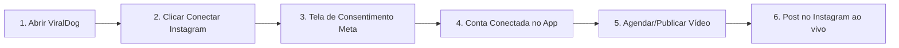

# Guia de Aprovação Meta App Review & Roteiro de Vídeo — ViralDog

Este documento contém o checklist completo, o roteiro exato de gravação do vídeo de demonstração (Screencast), as justificativas de permissões e as instruções de teste para aprovar o **ViralDog** no **Meta for Developers (Instagram Graph API)** e liberá-lo para clientes terceiros.

---

## 📋 1. Checklist: O que falta para liberar para terceiros?

Para que qualquer usuário externo consiga conectar sua conta do Instagram no ViralDog sem precisar ser cadastrado como testador:

1. **Gravar e anexar o vídeo de demonstração (Screencast)** mostrando o fluxo completo.
2. **Preencher as justificativas de cada permissão** solicitada no painel.
3. **Fornecer instruções de teste e credenciais** para a equipe de revisão da Meta.
4. **Ter as páginas legais ativas com HTTPS** (já configuradas no site):
   - Política de Privacidade: `https://www.viraldog.com.br/privacidade`
   - Termos de Serviço: `https://www.viraldog.com.br/termos`
   - Exclusão de Dados: `https://www.viraldog.com.br/exclusao-de-dados`
5. **Mudar o status do App de "Desenvolvimento" para "Ao Vivo" (Live Mode)** no painel da Meta após a aprovação.

---

## 🎥 2. Roteiro Exato do Vídeo de Screencast (Para Aprovação de Primeira)

> [!IMPORTANT]
> **Dicas de Ouro da Meta para o Vídeo:**
> - **Duração recomendada:** 1 a 3 minutos (máximo 5 min). Formato `.mp4` ou `.mov`.
> - **Áudio/Texto:** Pode ser em português ou inglês (se não quiser falar no microfone, use legendas ou anotações em texto claro na tela).
> - **Sem edições bruscas:** Não corte ou pule a janela de consentimento da Meta. O revisor precisa ver o fluxo contínuo e o nome do seu aplicativo visível na tela de permissões da Meta.

### Fluxo Visual do Screencast



### Tabela Passo a Passo da Gravação

| Tempo Estimado | O que mostrar na tela | O que falar / legendar |
| :--- | :--- | :--- |
| **00:00 - 00:20** | Abra o aplicativo ViralDog, faça login com um usuário de teste e vá até a aba de **Contas Conectadas** ou **MultiLogin**. | *"Este é o ViralDog, uma plataforma para criadores e empresas agendarem e publicarem vídeos no Instagram."* |
| **00:20 - 00:50** | Clique no botão **"Conectar Instagram Oficial"**. Mostre a janela oficial de login da Meta abrindo com o nome do aplicativo visível na tela de consentimento. | *"O usuário clica para vincular seu perfil profissional do Instagram usando o login oficial da Meta."* |
| **00:50 - 01:10** | Conceda as permissões necessárias e conclua a autorização. Mostre o redirecionamento voltando com sucesso e o perfil aparecendo como conectado no ViralDog. | *"Após autorizar as permissões, a conta do Instagram é vinculada com sucesso ao painel."* |
| **01:10 - 01:50** | Vá para a tela de **Agendador / Publicador**, selecione o perfil conectado, faça o upload de um vídeo/Reels de teste, adicione uma legenda e clique em **"Publicar Agora"** (ou agende para o minuto seguinte). | *"Demonstração da criação e publicação de um Reel utilizando a permissão instagram_content_publish."* |
| **01:50 - 02:20** | Abra o navegador no perfil do Instagram conectado (`instagram.com/seu_perfil`) e dê F5/Refresh mostrando o post recém-publicado pelo ViralDog no feed. | *"O vídeo foi publicado com sucesso no perfil do Instagram via API Oficial."* |

---

## 📝 3. Textos de Justificativa para as Permissões (Copie e Cole)

Na seção **Análise do Aplicativo ➔ Permissões e Recursos**, insira as respostas abaixo para cada permissão solicitada:

### 1. `instagram_business_content_publish` (ou `instagram_content_publish`)
* **Como seu aplicativo usa essa permissão?**
  > *"O ViralDog é uma ferramenta de produtividade e agendamento de conteúdo para criadores e empresas. Essa permissão é essencial para que os usuários possam agendar e publicar automaticamente seus vídeos, fotos e Reels em suas contas profissionais do Instagram diretamente pelo painel do aplicativo."*

### 2. `instagram_business_basic` (ou `instagram_basic`)
* **Como seu aplicativo usa essa permissão?**
  > *"Utilizamos esta permissão para identificar o perfil do Instagram Business/Creator conectado pelo usuário (nome de usuário, ID da conta e foto de perfil), permitindo que ele selecione em qual perfil deseja publicar seu conteúdo dentro do ViralDog."*

### 3. `pages_show_list` & `pages_read_engagement` *(se solicitado no fluxo Facebook)*
* **Como seu aplicativo usa essa permissão?**
  > *"Necessário para listar as Páginas do Facebook vinculadas à conta do usuário a fim de descobrir e conectar a conta profissional do Instagram correspondente."*

---

## 🔑 4. Instruções de Teste para o Revisor da Meta (Test Instructions)

No campo **Instruções para o Revisor**, forneça o seguinte texto:

```text
Passo a passo para teste do aplicativo ViralDog:
1. Abra o aplicativo ViralDog.
2. Faça login com as credenciais de teste fornecidas abaixo:
   - Usuário: [seu_usuario_de_teste]
   - Senha: [sua_senha_de_teste]
3. Acesse a aba "Contas" e clique no botão "Conectar Instagram Oficial".
4. Realize a autorização com sua conta de teste do Instagram Business/Creator.
5. Acesse o menu "Publicador", faça o upload de uma mídia de teste e clique em "Publicar Agora".
6. Verifique o conteúdo publicado diretamente na conta do Instagram.
```

---

## 🚀 5. Passos Finais no Painel do Meta Developers

1. Acesse: [Meta for Developers — Painel de Aplicativos](https://developers.facebook.com/apps/1532052538134583/)
2. Vá em **Análise do Aplicativo ➔ Solicitações**.
3. Anexe o vídeo `.mp4` gravado e cole as justificativas acima.
4. Clique em **Enviar para Análise**.
5. O tempo médio de resposta da Meta varia de 24 horas a 5 dias úteis.
6. Assim que aprovado, ative a chave no topo do painel para colocar o aplicativo em **Modo Ao Vivo (Live)**.
